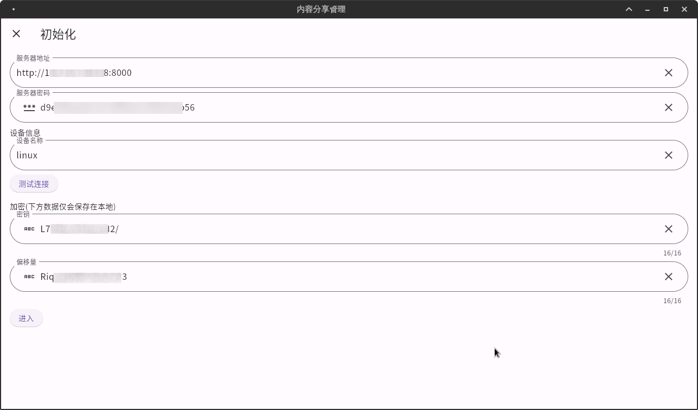

# 内容共享管理客户端
内容共享管理客户端是一个支持多平台的应用程序，通过访问[内容共享管理服务端](https://github.com/Webb-L/contentShareManageServer)，将内容发送至服务器，以供其他客户端浏览。

## 项目简介
内容共享管理客户端是一个方便用户分享和浏览内容的应用程序。它支持多平台，并且可以通过访问[内容共享管理服务端](https://github.com/Webb-L/contentShareManageServer)，将内容发送至服务器，以供其他客户端浏览。

## 主要功能和特点
以下是内容共享管理客户端的主要功能和特点：

+ 多平台支持：支持多种操作系统和设备，包括Windows、Mac、Linux、iOS和Android等。

+ 内容分享：支持将文本发送至[内容共享管理服务端](https://github.com/Webb-L/contentShareManageServer)，并在其他客户端上进行浏览。

+ 简单易用：提供简洁明了的用户界面，使用户能够轻松地添加、编辑和分享内容。

+ 安全可靠：提供身份验证、访问控制和加密传输等多种安全机制，确保用户的内容不受未授权访问和攻击。

## 安装和使用说明
安装和使用内容共享管理客户端非常简单：

1. [下载](https://github.com/Webb-L/contentShareManageClient/releases)并安装内容共享管理客户端。

2. 配置客户端，以便通过访问[内容共享管理服务端](https://github.com/Webb-L/contentShareManageServer)将内容发送至服务器。

   1. 
   2. 输入**服务器地址**后点击**服务器密码**左侧的按钮获取服务器的连接密码。
   3. 点击**测试连接**按钮在服务器创建一台可以发送和浏览内容。
   4. 点击**密钥**和**偏移量**左侧的按钮生成随机16位的字符串，用于加密和解密发送的内容。
      1. **密钥**和**偏移量**一定要16位，否则会出现无法加密和解密内容。
   5. 点击**进入**按钮。

3. 使用客户端添加、编辑和分享内容。

**注意：**如果您需要在其他使用，其他设备的配置必须和这里一样除了**设备名称**。

更详细的安装和使用说明，请参阅项目文档。

## 贡献指南
如果您希望为内容共享管理客户端做出贡献，您可以考虑以下几点：

+ 提交问题和建议：如果您在使用中遇到问题或有建议，请提交问题和建议。

+ 编写文档：为项目编写文档，使用户更容易地了解和使用该项目。

+ 提交代码：如果您有编程技能，可以提交代码并改进项目。

更多的贡献指南，请参阅项目贡献指南。

## 许可证
内容共享管理客户端采用Apache许可证开源，更多信息请查看项目许可证。